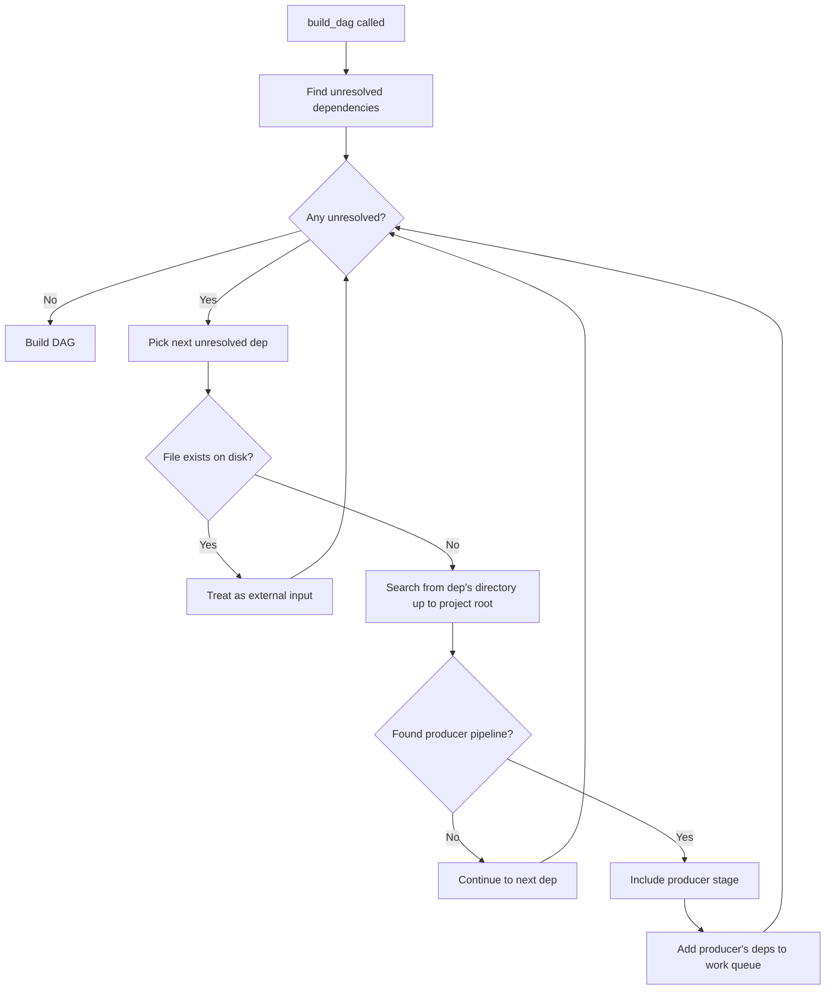

# Multi-Pipeline Documentation Design

**Goal:** Document the automatic discovery and lazy loading of pipelines based on dependency paths.

**Deliverables:**
1. `docs/tutorial/multi-pipeline.md` - Hands-on workflow guide
2. `docs/reference/discovery.md` - Detailed mechanics with diagrams
3. Update `docs/reference/pipelines.md` - Add link to new docs

---

## Tutorial: `docs/tutorial/multi-pipeline.md`

**Title:** Multi-Pipeline Projects

**Purpose:** Walk users through setting up a project with multiple pipelines that depend on each other, showing the automatic discovery in action.

### Outline

1. **Introduction** (~50 words)
   - When to use multiple pipelines (large projects, team boundaries, reusable components)
   - Key concept: Pivot automatically finds pipelines that produce your dependencies

2. **Example 1: Nested Pipelines** (~150 words + code)
   - Create a data preparation pipeline at project root
   - Create an analysis pipeline in a subdirectory that depends on the parent's output
   - Run from the subdirectory - show it "just works"
   - Explain: Pivot searched upward and found the producer

3. **Example 2: Sibling Pipelines** (~150 words + code)
   - Create `pipelines/feature_a/` and `pipelines/feature_b/`
   - Feature B depends on Feature A's output
   - Run from Feature B - automatic resolution
   - Explain: Pivot searched from the dependency's location

4. **Project Structure Recommendations** (~100 words)
   - When to split into multiple pipelines
   - Naming conventions
   - Link to reference for detailed mechanics

**Tone:** Hands-on, minimal explanation until after the "aha" moment.

---

## Reference: `docs/reference/discovery.md`

**Title:** Pipeline Discovery & Resolution

**Purpose:** Explain the mechanics of how Pivot finds project roots, discovers pipelines, and resolves cross-pipeline dependencies.

### Outline

1. **Project Root Discovery** (~100 words + diagram)
   - Walks upward from CWD to find top-most `.pivot/` directory
   - Error if no `.pivot/` found (suggests `pivot init`)
   - Diagram showing which `.pivot/` is selected

2. **Pipeline File Discovery** (~80 words)
   - Search order: `pivot.yaml` → `pivot.yml` → `pipeline.py`
   - Error if both YAML and Python exist in same directory
   - First found wins

3. **Automatic Dependency Resolution** (~150 words + diagram)
   - When `build_dag()` is called, unresolved dependencies trigger search
   - Algorithm: for each unresolved dep, search from dep's directory up to project root
   - Closest pipeline checked first
   - Transitive dependencies resolved iteratively
   - Mermaid flowchart showing the resolution algorithm

4. **Resolution Behavior** (~100 words)
   - Files on disk treated as external inputs (no search)
   - Included stages keep their original `state_dir`
   - Per-call caching (no stale state between runs)
   - Idempotent (safe to call multiple times)

5. **Troubleshooting** (~80 words)
   - "No .pivot directory found" → run `pivot init`
   - Dependency not resolved → check path spelling, ensure producer pipeline exists
   - Link to `pivot status --explain` for debugging

### Diagrams

**Project Root Discovery:**

```
Directory structure:          Project root selection:

repo/
├── .pivot/        ←───────── ✓ Top-most .pivot/ selected
├── pipeline.py
├── data/
│   └── raw.csv
└── analysis/
    ├── .pivot/    ←───────── ✗ Ignored (not top-most)
    └── pipeline.py

CWD: repo/analysis/
Result: repo/ is project root
```

**Dependency Resolution Flowchart:**



---

## Update: `docs/reference/pipelines.md`

**Location:** After "Pipeline Composition" section (around line 286), before "Path Resolution"

**Content to add:**

```markdown
## Multi-Pipeline Projects

For projects with multiple pipelines in separate directories, Pivot automatically discovers and includes stages from other pipelines when resolving dependencies. This enables:

- Parent pipelines providing shared data to child pipelines
- Sibling pipelines depending on each other's outputs
- Modular project organization without explicit `include()` calls

See the [Multi-Pipeline Tutorial](../tutorial/multi-pipeline.md) for a hands-on guide, or [Pipeline Discovery & Resolution](discovery.md) for detailed mechanics.
```

**Rationale:** Connects explicit `include()` (manual composition) with automatic discovery, helping users understand both options.

---

## Implementation Notes

- Tutorial should use concrete, runnable examples
- Reference diagrams should render in MkDocs (mermaid plugin)
- Keep examples minimal - avoid pandas/sklearn dependencies where possible
- Use `loaders.PathOnly()` and text files for simplicity
