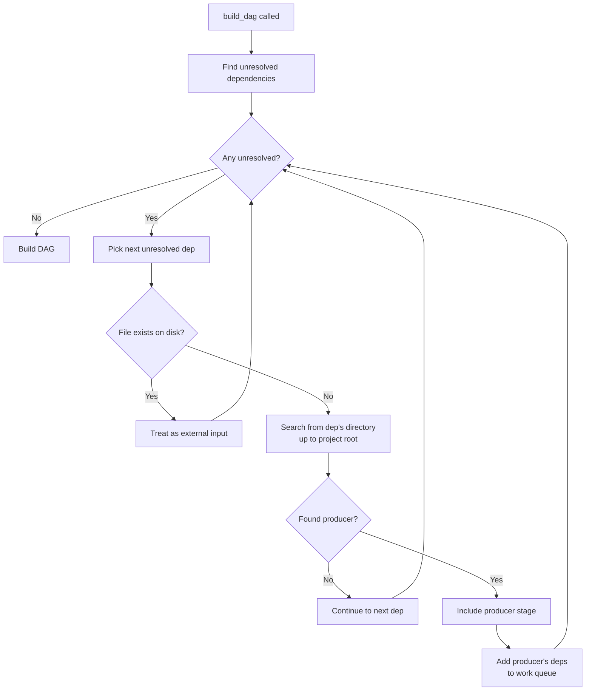

# Multi-Pipeline Documentation Implementation Plan

> **For Claude:** REQUIRED SUB-SKILL: Use superpowers:executing-plans to implement this plan task-by-task.

**Goal:** Document automatic discovery and lazy loading of pipelines based on dependency paths with a tutorial and reference page.

**Architecture:** Create two new doc pages (tutorial + reference) following existing conventions. Tutorial shows hands-on examples of nested and sibling pipelines. Reference explains mechanics with diagrams. Update pipelines.md with cross-link and mkdocs.yml with nav entries.

**Tech Stack:** MkDocs Material, Mermaid diagrams, Python code examples

---

## Task 1: Enable Mermaid Diagrams in MkDocs

**Files:**
- Modify: `mkdocs.yml:108-122`

**Step 1: Add mermaid configuration to superfences**

In `mkdocs.yml`, replace the `pymdownx.superfences` line (around line 113) with:

```yaml
  - pymdownx.superfences:
      custom_fences:
        - name: mermaid
          class: mermaid
          format: !!python/name:pymdownx.superfences.fence_code_format
```

**Step 2: Verify the change**

Run: `uv run mkdocs build --strict 2>&1 | head -20`
Expected: No errors related to mermaid

**Step 3: Commit**

```bash
jj describe -m "docs: enable mermaid diagrams in mkdocs"
```

---

## Task 2: Create Tutorial Page

**Files:**
- Create: `docs/tutorial/multi-pipeline.md`

**Step 1: Write the tutorial**

Create `docs/tutorial/multi-pipeline.md`:

```markdown
# Multi-Pipeline Projects

This tutorial shows how to organize larger projects with multiple pipelines that automatically discover each other's outputs.

## When to Use Multiple Pipelines

Split into multiple pipelines when you have:

- **Team boundaries** - Different teams own different parts of the workflow
- **Reusable components** - A data preparation step used by multiple analyses
- **Large monorepos** - Subdirectories that can run independently

## Example 1: Nested Pipelines (Parent/Child)

A common pattern: shared data preparation at the project root, with analysis pipelines in subdirectories.

### Project Structure

```
my_project/
├── .pivot/              # Project root (top-most .pivot/)
├── pipeline.py          # Produces shared/data.csv
├── shared/
│   └── data.csv
└── analysis/
    └── pipeline.py      # Consumes ../shared/data.csv
```

### Step 1: Initialize the Project

```bash
mkdir -p my_project/analysis my_project/shared
cd my_project
pivot init
```

### Step 2: Create the Parent Pipeline

Create `pipeline.py` at the project root:

```python
# my_project/pipeline.py
from pathlib import Path
from typing import Annotated, TypedDict

from pivot import loaders, outputs
from pivot.pipeline import Pipeline

pipeline = Pipeline("data_prep")


class PrepareOutputs(TypedDict):
    data: Annotated[Path, outputs.Out("shared/data.csv", loaders.PathOnly())]


def prepare() -> PrepareOutputs:
    """Generate shared dataset."""
    out = Path("shared/data.csv")
    out.parent.mkdir(exist_ok=True)
    out.write_text("id,value\n1,100\n2,200\n3,300\n")
    return PrepareOutputs(data=out)


pipeline.register(prepare)
```

### Step 3: Create the Child Pipeline

Create `analysis/pipeline.py`:

```python
# my_project/analysis/pipeline.py
from pathlib import Path
from typing import Annotated, TypedDict

from pivot import loaders, outputs
from pivot.pipeline import Pipeline

pipeline = Pipeline("analysis")


class AnalyzeOutputs(TypedDict):
    report: Annotated[Path, outputs.Out("report.txt", loaders.PathOnly())]


def analyze(
    data: Annotated[Path, outputs.Dep("../shared/data.csv", loaders.PathOnly())],
) -> AnalyzeOutputs:
    """Analyze the shared dataset."""
    content = data.read_text()
    lines = len(content.strip().split("\n")) - 1  # Exclude header

    out = Path("report.txt")
    out.write_text(f"Processed {lines} records\n")
    return AnalyzeOutputs(report=out)


pipeline.register(analyze)
```

### Step 4: Run from the Subdirectory

```bash
cd analysis
pivot repro
```

**What happens:**

1. Pivot finds project root by walking up to `my_project/` (top-most `.pivot/`)
2. The `analyze` stage needs `../shared/data.csv`
3. Pivot searches from that path upward and finds `my_project/pipeline.py`
4. The `prepare` stage is automatically included
5. Both stages run in correct order

You didn't need to call `include()` or configure anything - Pivot discovered the dependency automatically.

## Example 2: Sibling Pipelines

For larger projects, you might have pipelines at the same directory level that depend on each other.

### Project Structure

```
my_project/
├── .pivot/
└── pipelines/
    ├── feature_a/
    │   └── pipeline.py      # Produces output.csv
    └── feature_b/
        └── pipeline.py      # Consumes ../feature_a/output.csv
```

### Step 1: Create Sibling Pipelines

Create `pipelines/feature_a/pipeline.py`:

```python
# pipelines/feature_a/pipeline.py
from pathlib import Path
from typing import Annotated, TypedDict

from pivot import loaders, outputs
from pivot.pipeline import Pipeline

pipeline = Pipeline("feature_a")


class FeatureAOutputs(TypedDict):
    output: Annotated[Path, outputs.Out("output.csv", loaders.PathOnly())]


def compute_a() -> FeatureAOutputs:
    """Compute feature A."""
    out = Path("output.csv")
    out.write_text("feature,value\na1,10\na2,20\n")
    return FeatureAOutputs(output=out)


pipeline.register(compute_a)
```

Create `pipelines/feature_b/pipeline.py`:

```python
# pipelines/feature_b/pipeline.py
from pathlib import Path
from typing import Annotated, TypedDict

from pivot import loaders, outputs
from pivot.pipeline import Pipeline

pipeline = Pipeline("feature_b")


class FeatureBOutputs(TypedDict):
    combined: Annotated[Path, outputs.Out("combined.csv", loaders.PathOnly())]


def compute_b(
    a_data: Annotated[Path, outputs.Dep("../feature_a/output.csv", loaders.PathOnly())],
) -> FeatureBOutputs:
    """Combine with feature A."""
    a_content = a_data.read_text()

    out = Path("combined.csv")
    out.write_text(f"# Combined with feature_a\n{a_content}")
    return FeatureBOutputs(combined=out)


pipeline.register(compute_b)
```

### Step 2: Run Feature B

```bash
cd pipelines/feature_b
pivot repro
```

Pivot automatically discovers `feature_a/pipeline.py` because:

1. The dependency `../feature_a/output.csv` is in the `feature_a/` directory
2. Pivot searches from there and finds `feature_a/pipeline.py`
3. The `compute_a` stage produces that file, so it's included

## Project Structure Recommendations

**When to split pipelines:**

- Each pipeline should be runnable independently (for testing, CI)
- Split at natural boundaries (data prep vs. modeling vs. reporting)
- Keep pipelines that change together in the same directory

**Naming conventions:**

- Use descriptive directory names (`data_prep/`, `model_training/`, `reports/`)
- Pipeline names should match their purpose, not location

**See also:**

- [Pipeline Discovery & Resolution](../reference/discovery.md) - How the discovery algorithm works
- [Defining Pipelines](../reference/pipelines.md) - Pipeline basics and `include()`
```

**Step 2: Verify the file renders**

Run: `uv run mkdocs build --strict 2>&1 | grep -i "multi-pipeline\|error"`
Expected: No errors

**Step 3: Commit**

```bash
jj describe -m "docs(tutorial): add multi-pipeline projects guide"
```

---

## Task 3: Create Reference Page

**Files:**
- Create: `docs/reference/discovery.md`

**Step 1: Write the reference page**

Create `docs/reference/discovery.md`:

```markdown
# Pipeline Discovery & Resolution

This page explains how Pivot finds project roots, discovers pipelines, and automatically resolves cross-pipeline dependencies.

## Project Root Discovery

Pivot determines the project root by walking upward from the current directory and selecting the **top-most** directory containing a `.pivot/` folder.

```
repo/
├── .pivot/        ← Selected as project root (top-most)
├── pipeline.py
├── data/
│   └── raw.csv
└── analysis/
    ├── .pivot/    ← Ignored (not top-most)
    └── pipeline.py

CWD: repo/analysis/
Result: repo/ is the project root
```

**Why top-most?** This ensures a stable, consistent project root regardless of which subdirectory you run commands from. All paths resolve relative to the same root.

**If no `.pivot/` exists:** Pivot raises `ProjectNotInitializedError` with a suggestion to run `pivot init`.

## Pipeline File Discovery

Within a directory, Pivot searches for pipeline definitions in this order:

1. `pivot.yaml`
2. `pivot.yml`
3. `pipeline.py`

The first file found is used. If both a YAML file and `pipeline.py` exist in the same directory, Pivot raises an error to avoid ambiguity.

## Automatic Dependency Resolution

When you call `pivot repro` (or `build_dag()` in code), Pivot automatically resolves dependencies that aren't produced by stages in the current pipeline.

### The Algorithm



### Key Behaviors

**Search starts from the dependency's location:**

For a dependency like `../sibling/data/output.csv`, Pivot searches starting from `sibling/data/`, then `sibling/`, then parent directories up to project root. This enables sibling pipelines to discover each other.

**Closest pipeline wins:**

If multiple pipelines could produce an artifact, the one closest to the dependency's directory is used.

**Transitive dependencies are resolved:**

When a producer stage is included, its dependencies are added to the work queue. This continues until all dependencies are resolved or exist on disk.

**Files on disk are external inputs:**

If a dependency file already exists, Pivot treats it as an external input and doesn't search for a producer. This lets you mix generated and manually-created files.

### Resolution Behavior

| Scenario | Behavior |
|----------|----------|
| Dependency has local producer | Use local stage |
| Dependency file exists on disk | Treat as external input |
| Dependency in parent directory | Search parent pipelines |
| Dependency in sibling directory | Search from dep's location upward |
| No producer found | Error at DAG validation |

### State Isolation

When stages are included from external pipelines:

- **Stages are deep-copied** - Changes don't affect the source pipeline
- **Original `state_dir` preserved** - Lock files stay in the source pipeline's `.pivot/`
- **Project cache is shared** - File content cache is project-wide

This means each pipeline maintains its own state while sharing cached file contents.

## Troubleshooting

### "No .pivot directory found"

Run `pivot init` in your project root to create the `.pivot/` directory.

### Dependency not resolved

1. **Check the path** - Ensure the dependency path is correct relative to the consuming pipeline
2. **Verify producer exists** - The producing pipeline must have a stage with a matching output path
3. **Check for typos** - Output paths must match exactly

Use `pivot status --explain` to see detailed information about dependencies and why stages would run.

### Unexpected stage inclusion

If Pivot includes stages you didn't expect:

1. Run `pivot dag --stages` to visualize what was included
2. Check if a dependency path accidentally matches another pipeline's output
3. Consider using explicit `include()` for more control

## See Also

- [Multi-Pipeline Tutorial](../tutorial/multi-pipeline.md) - Hands-on examples
- [Defining Pipelines](../reference/pipelines.md) - Pipeline basics and explicit `include()`
- [Path Resolution](../reference/pipelines.md#path-resolution) - How paths are resolved
```

**Step 2: Verify the file renders**

Run: `uv run mkdocs build --strict 2>&1 | grep -i "discovery\|error"`
Expected: No errors

**Step 3: Commit**

```bash
jj describe -m "docs(reference): add pipeline discovery and resolution"
```

---

## Task 4: Update pipelines.md with Cross-Link

**Files:**
- Modify: `docs/reference/pipelines.md:285-286`

**Step 1: Read current content around insertion point**

The "Pipeline Composition" section ends around line 286. We'll insert after it.

**Step 2: Add the new section**

Insert after line 286 (after the "### Semantics" subsection under "Pipeline Composition"):

```markdown

## Multi-Pipeline Projects

For projects with multiple pipelines in separate directories, Pivot automatically discovers and includes stages from other pipelines when resolving dependencies. This enables:

- Parent pipelines providing shared data to child pipelines
- Sibling pipelines depending on each other's outputs
- Modular project organization without explicit `include()` calls

See the [Multi-Pipeline Tutorial](../tutorial/multi-pipeline.md) for a hands-on guide, or [Pipeline Discovery & Resolution](discovery.md) for detailed mechanics.
```

**Step 3: Verify the link works**

Run: `uv run mkdocs build --strict 2>&1 | grep -i "pipelines.md\|error"`
Expected: No broken link errors

**Step 4: Commit**

```bash
jj describe -m "docs(reference): add multi-pipeline cross-reference to pipelines.md"
```

---

## Task 5: Update mkdocs.yml Navigation

**Files:**
- Modify: `mkdocs.yml:69-80`

**Step 1: Add tutorial to nav**

In the `Tutorials:` section (around line 69-73), add:

```yaml
  - Tutorials:
    - Watch Mode & Rapid Iteration: tutorial/watch.md
    - Parameters & Experiments: tutorial/parameters.md
    - Multi-Pipeline Projects: tutorial/multi-pipeline.md
    - Remote Storage & CI: tutorial/remote.md
```

**Step 2: Add reference to nav**

In the `Reference:` section (around line 74-80), add after "Defining Pipelines":

```yaml
  - Reference:
    - Defining Pipelines: reference/pipelines.md
    - Pipeline Discovery: reference/discovery.md
    - Dependencies & Loaders: reference/dependencies.md
    - Outputs & Caching: reference/outputs.md
    - Parameters: reference/parameters.md
    - Matrix Stages: reference/matrix.md
    - Watch Mode: reference/watch.md
    - Configuration: reference/configuration.md
```

**Step 3: Verify navigation**

Run: `uv run mkdocs build --strict && echo "Build successful"`
Expected: "Build successful"

**Step 4: Commit**

```bash
jj describe -m "docs: add multi-pipeline pages to navigation"
```

---

## Task 6: Final Verification

**Step 1: Build docs and check for warnings**

Run: `uv run mkdocs build --strict 2>&1`
Expected: No warnings or errors

**Step 2: Serve docs locally and spot-check**

Run: `uv run mkdocs serve &`
Then open http://127.0.0.1:8000 and verify:
- Tutorial appears in nav under "Tutorials"
- Reference appears in nav under "Reference"
- Mermaid diagram renders in discovery.md
- Cross-links work

Run: `kill %1` to stop the server

**Step 3: Final commit**

```bash
jj describe -m "docs: add multi-pipeline documentation

- Tutorial with nested and sibling pipeline examples
- Reference page with discovery algorithm and mermaid diagram
- Cross-link from pipelines.md
- Enable mermaid rendering in mkdocs"
```

---

## Summary

| Task | Description | Files |
|------|-------------|-------|
| 1 | Enable mermaid diagrams | `mkdocs.yml` |
| 2 | Create tutorial page | `docs/tutorial/multi-pipeline.md` |
| 3 | Create reference page | `docs/reference/discovery.md` |
| 4 | Add cross-link | `docs/reference/pipelines.md` |
| 5 | Update navigation | `mkdocs.yml` |
| 6 | Final verification | - |
