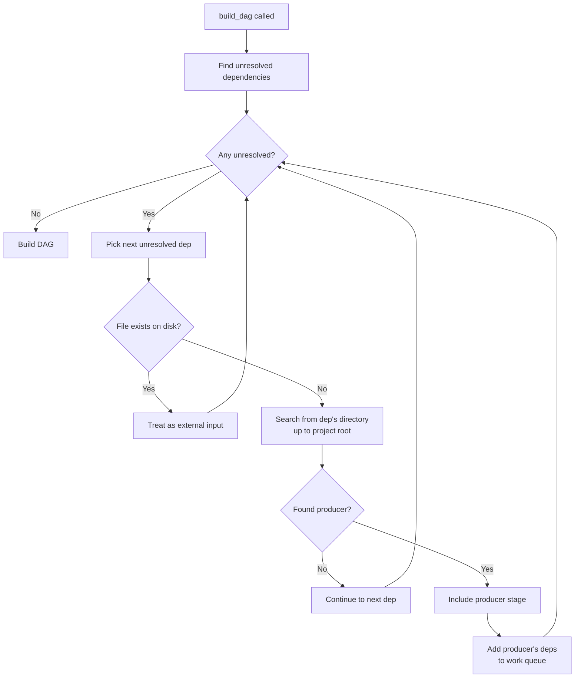

# Pipeline Discovery & Resolution

This page explains how Pivot finds project roots, discovers pipelines, and automatically resolves cross-pipeline dependencies. For a hands-on walkthrough, see the [Multi-Pipeline Tutorial](../tutorial/multi-pipeline.md).

## Project Root Discovery

Pivot determines the project root by walking upward from the current directory and selecting the **top-most** directory containing a `.pivot/` folder.

```
repo/
├── .pivot/        ← Selected as project root (top-most)
├── pipeline.py
├── data/
│   └── raw.csv
└── analysis/
    ├── .pivot/    ← Ignored (not top-most)
    └── pipeline.py

CWD: repo/analysis/
Result: repo/ is the project root
```

**Why top-most?** This ensures a stable, consistent project root regardless of which subdirectory you run commands from. All paths resolve relative to the same root.

**If no `.pivot/` exists:** Pivot raises `ProjectNotInitializedError` with a suggestion to run `pivot init`.

## Pipeline File Discovery

Within a directory, Pivot searches for pipeline definitions in this order:

1. `pivot.yaml`
2. `pivot.yml`
3. `pipeline.py`

The first file found is used. If both a YAML file and `pipeline.py` exist in the same directory, Pivot raises an error to avoid ambiguity.

## Automatic Dependency Resolution

When you call `pivot repro` (or `build_dag()` in code), Pivot automatically resolves dependencies that aren't produced by stages in the current pipeline.

### The Algorithm



### Key Behaviors

**Search starts from the dependency's location:**

For a dependency like `../sibling/data/output.csv`, Pivot searches starting from `sibling/data/`, then `sibling/`, then parent directories up to project root. This enables sibling pipelines to discover each other.

**Closest pipeline wins:**

If multiple pipelines could produce an artifact, the one closest to the dependency's directory is used.

**Transitive dependencies are resolved:**

When a producer stage is included, its dependencies are added to the work queue. This continues until all dependencies are resolved or exist on disk.

**Files on disk are external inputs:**

If a dependency file already exists, Pivot treats it as an external input and doesn't search for a producer. This lets you mix generated and manually-created files.

### Resolution Behavior

| Scenario | Behavior |
|----------|----------|
| Dependency has local producer | Use local stage |
| Dependency file exists on disk | Treat as external input |
| Dependency in parent directory | Search parent pipelines |
| Dependency in sibling directory | Search from dep's location upward |
| No producer found | Error at DAG validation |

### State Isolation

When stages are included from external pipelines:

- **Stages are deep-copied** - Changes don't affect the source pipeline
- **Original `state_dir` preserved** - Lock files stay in the source pipeline's `.pivot/`
- **Project cache is shared** - File content cache is project-wide

This means each pipeline maintains its own state while sharing cached file contents.

## Troubleshooting

### "No .pivot directory found"

Run `pivot init` in your project root to create the `.pivot/` directory.

### Dependency not resolved

1. **Check the path** - Ensure the dependency path is correct relative to the consuming pipeline
2. **Verify producer exists** - The producing pipeline must have a stage with a matching output path
3. **Check for typos** - Output paths must match exactly

Use `pivot status --explain` to see detailed information about dependencies and why stages would run.

### Unexpected stage inclusion

If Pivot includes stages you didn't expect:

1. Run `pivot dag --stages` to visualize what was included
2. Check if a dependency path accidentally matches another pipeline's output
3. Consider using explicit `include()` for more control

## See Also

- [Multi-Pipeline Tutorial](../tutorial/multi-pipeline.md) - Hands-on examples
- [Defining Pipelines](pipelines.md) - Pipeline basics and explicit `include()`
- [Path Resolution](pipelines.md#path-resolution) - How paths are resolved
